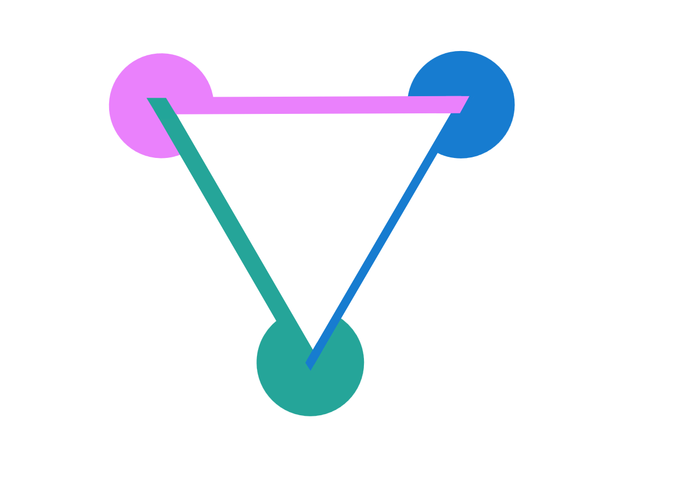

# Graphax
This package contains the implementation of the sparse cross-country elimination
method for Automatic Differentiation (AD).

## Installation
The package requires has the following dependencies:
- jax
- numpy
- scipy
- matplotlib
The package itself is to be installed by running `pip install -e .` in the root 
directory.

## Usage
The package exposes a routing called `jacve` which is the equivalent of `jax.jacfwd` and `jax.jacrev`. It provides an additional keyword `order` which is used to pass the elimination order for cross-country elimination.
It has two default modes `fwd` and `rev` which implement forward-mode and reverse-mode AD.
It is fully compatible with `jax.jit` and `jax.vmap`.
Example command:
`graphax.jacve(f, order=[1,3,2,4], argnums=(0,1,2,3))(1., 1., 2., 7.)`.

## Directory structure
The project structure is described in the following section:
- graphax
    - docs
    - src
        - **graphax**
            - **example**
                This folder contains the python implementation of the tasks analyzed in the paper.
            - **sparse**
                - *tensor.py*
                    This file is the heart of Graphax. It implements the sparse routines that are used in vectorized cross-country elimination.
                - *utils.py*
                    Supporting utils for the sparse implementation.
            - *perf.py*
                This file contains the code that was used to benchmark the elimination orders.
            - *core.py*
                This file provides the functionalities that implement the tracing of the Python function with JAX and subsequently build a computational graph.
                It also contains the base implementation of the vertex elimination procedure.
            - *primitives.py*
                This file contains the definitions fo the Jacobians of required for the sparse vertex elimination procedure.
                For every operation that we intend to use we have to define its behavior here first so that the source code of the original function is transformed accordingly.
    - tests

